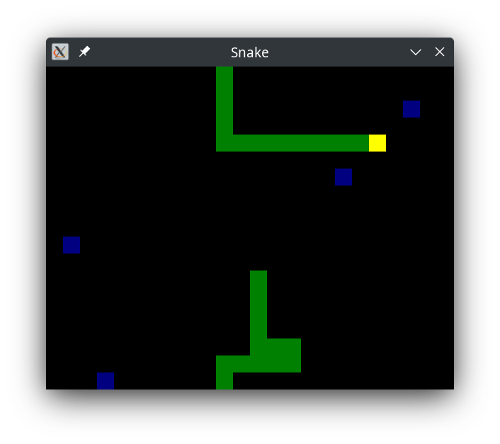

<p align="center">
	
</p>

# Snake game written in ANSI C

Everyone knows what the snake game is: You eat food, the line/snake grows bigger. There is not much else to it, you can read the [Wikipedia article](https://en.wikipedia.org/wiki/Snake_%28video_game_genre%29) if you want more information. In particular, this version of Snake has the "snake", warping and multiple food.

I usually use this project as "testing grounds" for a new platform or development environment since its easily portable and I know its behavior very well, so if something goes very wrong its immediately noticeable.

## Building

An ANSI C / C89 compliant compiler is needed, a C++ compiler works as well since this code is written with the `-Wc++-compat` compiler flag in mind, the only dependencies for this project are `libc` and [SDL](https://www.libsdl.org/).

To compile you can simply do `cc -I/usr/include/SDL2 -lSDL2 src/snake.c src/main.c` on most systems. For more ellaborated building or development, you should use [Meson](https://mesonbuild.com/).

Support to build with [emscripten](https://emscripten.org/) is provided! Assuming you have the toolchain in `PATH` already you can get started with:

```sh
meson setup --cross-file wasm-cross.ini build-emscripten && cd build-emscripten
meson compile
# Remember that you need a server to deliver the .wasm / .js files!
python -m http.server
```
